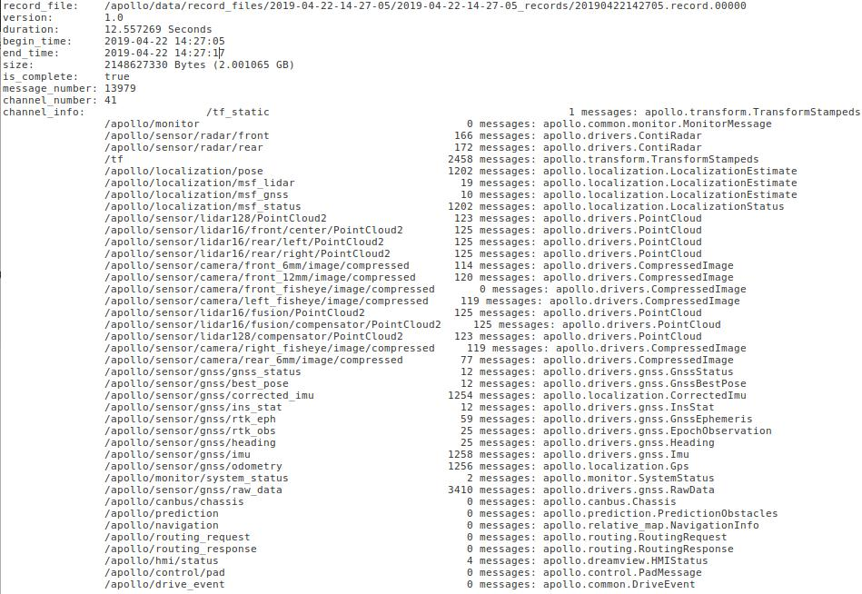

## Apollo cyber-record file parser (Python based)

#### Introduction

This tool presents multiple examples of how to parse data from a record file and
save using predefined format. The tool has been built on example provided within
Apollo (`/apollo/cyber/python/examples/`).

The samples provided here illustrate cases for, parsing data from:

- lidar: based on
  [Velodyne VLS-128](https://github.com/ApolloAuto/apollo/blob/r6.0.0/docs/specs/Lidar/VLS_128_Installation_Guide.md)
- radar: based on
  [Continental ARS-408-21](https://github.com/ApolloAuto/apollo/blob/r6.0.0/docs/specs/Radar/Continental_ARS408-21_Radar_Installation_Guide.md)
- camera: based on
  [Leopard Imaging Inc's Camera - LI-USB30-AZ023WDRB](https://github.com/ApolloAuto/apollo/blob/r6.0.0/docs/specs/Camera/Leopard_Camera_LI-USB30-AZ023WDR__Installation_Guide.md)

#### Files and functions:

The files/functions provided are as follows:

- [`record_parse_save.py`](./record_parse_save.py): main function that parses
  record files from and saves extracted data to specified location
- [`parse_lidar.py`](./parse_lidar.py): function to parse lidar data
- [`parse_radar.py`](./parse_radar.py): function to parse radar data
- [`parse_camera.py`](./parse_camera.py): function to parse camera data
- [`parser_params.yaml`](./parser_params.yaml): YAML file with details of
  record-file location, where the output files should be saved and what sensor
  data should be parsed along with specific channel-names associated with
  particular sensor, it's configuration and it's location.
  - list of channels in a record-file can be obtained using
    `cyber_recorder info`. For example, to get details on a sample record file
    `20190422142705.record.00000` saved at:
    `/apollo/data/record_files/2019-04-22-14-27-05/2019-04-22-14-27-05_records/`
    enter following at command prompt:
    - `cyber_recorder info /apollo/data/record_files/2019-04-22-14-27-05/2019-04-22-14-27-05_records/20190422142705.record.00000`
    - The output on screen will look like that presented in the image below:

#### Dependency

> sudo pip install pyyaml

#### How-to-use:

- It is assumed that the user is within Apollo docker environment and has
  successfully built it. Please check documentation on
  [Build Apollo](https://github.com/ApolloAuto/apollo/blob/r6.0.0/docs/howto/how_to_launch_and_run_apollo.md) if
  required.
- Modify parameters specified within `parser_params.yaml` to serve your purpose.
- After correct parameters are specified in the YAML file, run parser function
  in `/apollo` using:

`./bazel-bin/modules/tools/record_parse_save/record_parse_save`

- parsed sensor data will be saved in new folder along with associated capture
  or scan timestamps in a text file.

#### NOTES

- In the example setup here, parsed data is saved within the parent folder
  containing the records-file's folder. Every saved file has associated
  timestamp with it.
- All record-files within the folder are parsed. If any record file is corrupt,
  the parser will display error message and continue to next record file.
- `radar` data is saved in text files in JSON format for each scan
- `lidar` point-cloud data is saved in text files for each scan
- `camera` images are saved in jpeg file for each capture
- All timestamps are saved in a separate file with `timestamp` suffix, in the
  same order in which the parsed files are saved in corresponding folder.
